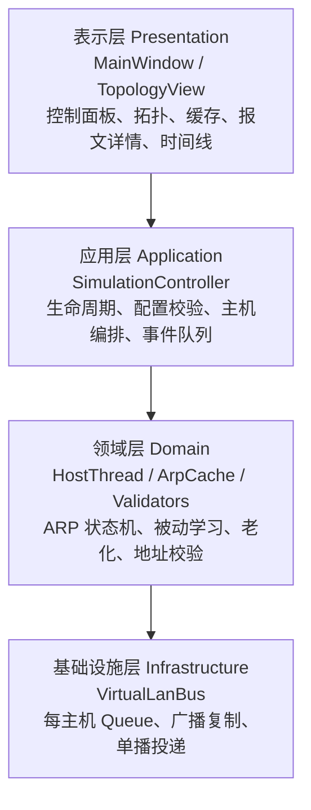
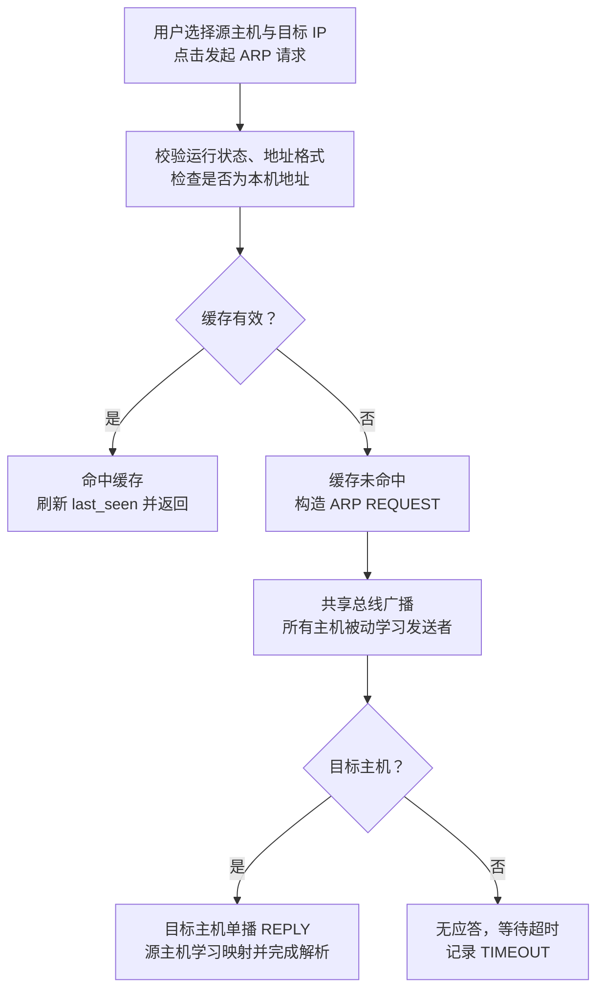
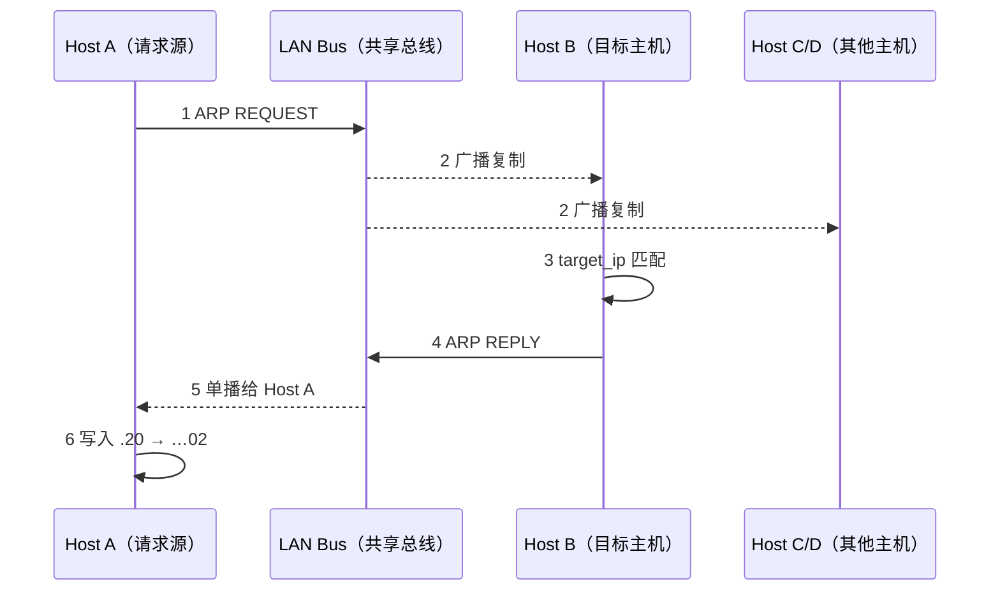

# 武汉科技大学计算机科学与技术学院

## 课 程 设 计 报 告

### ARP 地址解析协议仿真软件

**设计与实现**

| 项目 | 信息 |
|---|---|
| 课程名称 | 计算机网络课程设计 |
| 专业 | 网络工程（国际） |
| 班级 | 2024级 ______ 班 |
| 学号 | __________________ |
| 姓名 | __________________ |
| 指导教师 | __________________ |
| 课程设计日期 | 2026年8月 |

> 注：封面中的班级、学号、姓名和指导教师需在提交前补全。

---

## 摘要

地址解析协议（Address Resolution Protocol，ARP）负责在 IPv4 局域网中完成 IP 地址到 MAC 地址的映射，是理解网络层与数据链路层协同关系的重要协议。本课程设计基于 Python 与 PySide6 实现了一套 ARP 地址解析协议仿真软件，通过可视化局域网拓扑完整呈现 ARP 请求广播、ARP 应答单播、被动学习、缓存命中、映射更新、老化删除及未知目标超时等过程。系统默认创建 Host A 至 Host D 四台主机，并可扩展至六台；每台主机由独立线程模拟，通过共享消息队列构成虚拟局域网广播信道。

系统采用表示层、应用层、领域层与基础设施层的分层结构。图形界面负责拓扑交互、报文动画、缓存快照和协议事件时间线；控制器负责线程生命周期与配置管理；主机线程执行 ARP 状态机；虚拟总线完成延迟广播和单播投递。为保证现场演示清晰，报文动画被拆分为“主机到总线”和“总线到主机”两个阶段，同时支持拓扑缩放、平移、节点拖动、总线拖动、主机编辑和快捷设置源/目标。

测试结果表明，缓存生命周期、广播/单播语义、完整 ARP 解析流程以及暂停期间不计入缓存老化时间等四项自动化测试均通过。系统在输入校验、重复请求抑制、线程退出和异常提示方面具备基本容错能力，能够满足任务书对协议核心功能、多线程、共享消息队列和图形化展示的要求。

**关键词：** ARP；地址解析；多线程；消息队列；PySide6；协议可视化

## 目录

- [1 需求分析](#1-需求分析)
  - [1.1 课题背景与设计目标](#11-课题背景与设计目标)
  - [1.2 功能需求](#12-功能需求)
  - [1.3 非功能需求与约束](#13-非功能需求与约束)
  - [1.4 运行环境与操作流程](#14-运行环境与操作流程)
- [2 概要设计](#2-概要设计)
  - [2.1 总体架构](#21-总体架构)
  - [2.2 模块划分与线程模型](#22-模块划分与线程模型)
  - [2.3 数据结构与状态设计](#23-数据结构与状态设计)
  - [2.4 图形界面设计](#24-图形界面设计)
- [3 详细设计与实现](#3-详细设计与实现)
  - [3.1 ARP 请求与应答算法](#31-arp-请求与应答算法)
  - [3.2 ARP 缓存与暂停感知老化](#32-arp-缓存与暂停感知老化)
  - [3.3 虚拟局域网广播/单播](#33-虚拟局域网广播单播)
  - [3.4 控制器与多线程生命周期](#34-控制器与多线程生命周期)
  - [3.5 拓扑交互与分阶段动画](#35-拓扑交互与分阶段动画)
  - [3.6 输入校验与容错](#36-输入校验与容错)
- [4 调试分析](#4-调试分析)
  - [4.1 测试环境与测试方法](#41-测试环境与测试方法)
  - [4.2 测试数据及结果](#42-测试数据及结果)
  - [4.3 算法复杂度分析](#43-算法复杂度分析)
  - [4.4 调试问题、解决方法与改进设想](#44-调试问题解决方法与改进设想)
- [5 课程设计总结](#5-课程设计总结)
- [参考文献](#参考文献)
- [附录 A 关键源程序](#附录-a-关键源程序)

## 1 需求分析

### 1.1 课题背景与设计目标

ARP 用于解决同一广播域内 IPv4 地址与链路层 MAC 地址之间的映射问题。当源主机只知道目标 IP 而不知道目标 MAC 时，需要广播 ARP 请求；目标主机识别目标 IP 后单播回复；源主机再将地址映射写入本地缓存，以减少后续广播。本项目不访问真实网卡、不发送真实以太网帧，也不修改操作系统 ARP 表，而是在可重复、可观察的虚拟局域网中模拟协议语义。

设计目标是将协议逻辑、线程通信和图形呈现统一到一个可现场操作的应用中，使教师能够直接观察“谁发起请求、广播到谁、谁进行应答、哪些主机被动学习、缓存何时命中或老化”的全过程。系统还需保证结构清晰、关键模块可单独测试，且错误输入不会造成崩溃、死循环或线程泄漏。

> **选题范围**：采用题目一“ARP 地址解析协议仿真软件”。实现语言为 Python 3，GUI 框架为 PySide6；默认 4 台主机，最多 6 台；演示方式为手动选择源主机和目标 IP 后发起请求；接收报文的主机被动学习发送者映射，目标主机负责应答。

### 1.2 功能需求

| 编号 | 模块 | 功能要求 | 实现状态 |
|---|---|---|---|
| FR-01 | 局域网拓扑 | 显示 4～6 台主机及独立 IP/MAC；节点和总线可拖动，画布可缩放和平移。 | 已实现 |
| FR-02 | ARP 请求 | 缓存未命中时构造 REQUEST，以共享总线向所有在线主机广播。 | 已实现 |
| FR-03 | ARP 应答 | 目标 IP 所属主机生成 REPLY，并只向请求源主机单播。 | 已实现 |
| FR-04 | ARP 缓存 | 独立缓存、被动学习、新增/更新/命中、5～120 秒可配置老化与超时删除。 | 已实现 |
| FR-05 | 报文可视化 | 分阶段动画展示广播扩散和单播路径，日志可查看完整报文字段。 | 已实现 |
| FR-06 | 仿真控制 | 启动、暂停、继续、重置；暂停期间报文处理和缓存计时均冻结。 | 已实现 |
| FR-07 | 主机管理 | 添加/编辑主机；校验名称、IPv4、MAC 与地址唯一性；最多六台。 | 已实现 |
| FR-08 | 异常演示 | 自身目标直接返回、相同目标请求去重、未知目标约 4 秒后超时。 | 已实现 |

### 1.3 非功能需求与约束

- **响应性：** GUI 线程只处理界面更新，不执行阻塞式协议循环；主机线程通过线程安全事件队列向界面传递状态。
- **一致性：** 用户可见名称统一使用 Host A～Host F，内部 `host-1` 等稳定标识不直接暴露在时间线中。
- **可测试性：** 缓存、总线、主机线程与控制器不依赖图形界面，可在无显示器环境下执行单元测试。
- **可解释性：** 事件日志保留报文编号、操作类型、源/目标地址、传播方式和缓存变化，支持答辩追溯。
- **健壮性：** 拒绝无效 IPv4、无效 MAC、重复地址、超出主机上限、未启动请求和暂停状态请求。
- **规模约束：** 同一虚拟广播域内主机数量为 4～6 台，适合教学展示，不以大规模网络性能为目标。

### 1.4 运行环境与操作流程

| 项目 | 配置 |
|---|---|
| 操作系统 | macOS 26.6.2（同样可运行于 Windows/Linux） |
| 语言 | Python 3.14.3 |
| GUI 框架 | PySide6 6.11.2 |
| 并发与通信 | `threading.Thread`、`queue.Queue`、`threading.Timer` |
| 测试框架 | pytest 9.1.1 |
| 启动入口 | `main.py` 或双击“启动ARP仿真器.command” |

1. 启动程序后检查默认 Host A～Host D、运行状态和空缓存。
2. 点击“启动”，选择源主机与目标 IP，再点击“发起 ARP 请求”。
3. 观察橙色请求广播、绿色应答单播、事件时间线与缓存变化。
4. 再次解析同一目标验证缓存命中；缩短老化时间验证超时删除。
5. 输入不存在的目标 IP 验证请求超时；添加或编辑主机验证地址校验。

## 2 概要设计

### 2.1 总体架构

系统采用四层结构，将界面、流程编排、协议语义与传输机制解耦。表示层通过 Qt 信号和定时器读取事件队列；应用层统一维护主机配置和仿真状态；领域层负责 ARP 处理与缓存；基础设施层只负责报文投递，不解析协议内容。分层后，协议测试不需要启动 GUI，拓扑动画也不会改变协议运行结果。



**图2-1 系统分层架构。**

### 2.2 模块划分与线程模型

| 模块 | 主要职责 | 层次 |
|---|---|---|
| `models.py` | `HostConfig`、`ArpPacket`、`ArpCacheEntry`、`SimulationEvent` 等数据模型。 | 领域模型 |
| `validators.py` | 名称、IPv4、MAC 规范化和格式校验。 | 输入校验 |
| `cache.py` | 缓存学习、查询、快照、过期和暂停时间平移。 | 领域服务 |
| `lan_bus.py` | 注册接收队列、广播、单播、延迟投递和关闭。 | 基础设施 |
| `host_thread.py` | 每台主机的协议循环、状态机、被动学习和超时。 | 并发核心 |
| `controller.py` | 启动/暂停/重置、配置管理、命令编排。 | 应用服务 |
| `main_window.py` | 三栏工作区、缓存表、报文详情、事件时间线。 | 表示层 |
| `topology_view.py` | 节点/总线交互、缩放平移、动态路由动画。 | 可视化 |

控制器启动时为每个 `HostConfig` 创建一个 `HostThread`。每个线程在 `VirtualLanBus` 中注册一个独立 `Queue[ArpPacket]`，从本机队列取报文并写入本机 `ArpCache`。广播时总线向所有注册队列放入报文副本；单播时只向 `destination_host_id` 对应的队列投递。线程不直接访问其他主机对象，也不直接修改 Qt 控件。

> **并发边界**：主机线程之间只通过共享消息队列通信；缓存对象由所属主机维护，并通过锁保护快照读取；GUI 通过 `SimulationEvent` 队列获得不可变事件。这一边界降低了线程竞争和界面崩溃风险。

### 2.3 数据结构与状态设计

| 结构 | 关键字段 | 用途 |
|---|---|---|
| `HostConfig` | `host_id`、`name`、`ip`、`mac`、`x`、`y` | 稳定标识、显示地址与拓扑位置 |
| `ArpPacket` | `packet_id`、`opcode`、sender/target 地址、source/destination | ARP 请求或应答 |
| `ArpCacheEntry` | `ip`、`mac`、`learned_at`、`last_seen`、`state` | 一条 IP-MAC 缓存记录 |
| `SimulationEvent` | `event_type`、`timestamp`、`host_id`、`payload` | 线程到 GUI 的状态消息 |
| `dict[str, ArpCacheEntry]` | IP 为键 | 平均 O(1) 的查询与更新 |
| `dict[str, Queue]` | `host_id` 为键 | 广播域中的接收队列集合 |

主机状态包含 `IDLE`、`BROADCASTING`、`REPLYING`、`RESOLVED`、`PAUSED` 和 `TIMEOUT`。缓存变化包含 `MISS`、`NEW`、`UPDATED`、`HIT` 和 `EXPIRED`。状态通过事件队列驱动节点颜色、右侧状态标签和时间线文本，协议语义与视觉语义保持一一对应。

### 2.4 图形界面设计

主窗口使用三栏布局：左侧控制请求参数、仿真运行和主机管理；中间显示可交互局域网拓扑；右侧显示当前主机的 ARP 缓存与报文详情；底部协议事件时间线记录完整过程。拓扑工具栏提供缩小、比例、放大、适应窗口和恢复默认布局。


**图2-2 最终版主界面（ARP 请求/应答过程）。**

节点支持单击选择、拖动位置、双击编辑和右键设置源/目标；总线可拖动；连接线可悬停高亮。画布缩放范围为 100%～300%，滚轮以鼠标位置为锚点，放大后可拖动空白区域平移，双击空白处恢复默认比例。动画端点实时读取节点和总线位置，因此动画播放中调整拓扑也不会出现路径脱离。

## 3 详细设计与实现

### 3.1 ARP 请求与应答算法

用户发起解析时，控制器先检查仿真是否启动、是否暂停、源主机是否存在以及目标 IPv4 是否有效。若目标为本机地址则直接返回 `SELF`；否则由源主机查询缓存。命中时刷新 `last_seen` 并产生 `HIT` 事件；未命中时生成目标 MAC 全零的 `REQUEST`，将其记录到 `_pending` 后广播。



**图3-1 ARP 地址解析处理流程。**

所有收到 `REQUEST` 的主机先学习 `sender_ip → sender_mac`。只有本机 IP 等于 `target_ip` 的主机才构造 `REPLY`；应答字段中的 sender 为目标主机自身地址，target 为原请求源地址，`destination_host_id` 指向原请求源。源主机收到应答后学习目标映射、移除待处理请求并进入 `RESOLVED` 状态。若超过 `request_timeout` 未收到应答，则进入 `TIMEOUT` 并输出错误事件。



**图3-2 Host A 解析 Host B 的交互时序。**

| 字段 | ARP 请求 | ARP 应答 |
|---|---|---|
| `opcode` | `REQUEST` | `REPLY` |
| `sender_ip / sender_mac` | 源主机地址 | 目标主机地址 |
| `target_ip` | 待解析 IP | 原请求源 IP |
| `target_mac` | `00:00:00:00:00:00` | 原请求源 MAC |
| `destination_host_id` | `None`（广播） | 原请求源 `host_id`（单播） |

**表3-1 请求与应答报文字段对比。**

### 3.2 ARP 缓存与暂停感知老化

`ArpCache` 使用字典保存条目，并使用 `RLock` 保证主机线程更新与 GUI 快照读取的并发安全。`learn()` 根据旧条目判断 `NEW`、`UPDATED` 或 `HIT`；`lookup()` 在未过期时刷新 `last_seen`；`expire()` 每 200 ms 扫描并删除超时条目。

```python
def learn(self, ip: str, mac: str, now: float | None = None):
    now = self._clock() if now is None else now
    with self._lock:
        old = self._entries.get(ip)
        change = CacheChange.NEW if old is None else (
            CacheChange.UPDATED if old.mac != mac else CacheChange.HIT
        )
        entry = ArpCacheEntry(ip, mac, old.learned_at if old else now, now, change)
        self._entries[ip] = entry
        return entry, change

def expire(self, now: float | None = None):
    now = self._clock() if now is None else now
    expired = []
    with self._lock:
        for ip, entry in list(self._entries.items()):
            if now - entry.last_seen >= self.aging_seconds:
                entry.state = CacheChange.EXPIRED
                expired.append(entry)
                del self._entries[ip]
    return expired
```

暂停不是简单停止界面刷新。`HostThread` 在暂停时记录单调时钟 `_paused_at`；继续时计算 `paused_for`，并将所有缓存条目的 `learned_at`、`last_seen` 及待处理请求的 `started_at` 同步向后平移。这样等待期间不会错误消耗缓存寿命，也不会使未知目标在暂停中超时。

```python
def set_paused(self, paused: bool) -> None:
    if paused:
        if self._paused_at is None:
            self._paused_at = time.monotonic()
        self.pause_event.clear()
        self.status = "PAUSED"
    else:
        if self._paused_at is not None:
            paused_for = time.monotonic() - self._paused_at
            self.cache.shift_timestamps(paused_for)
            self._pending = {
                ip: (packet_id, started_at + paused_for)
                for ip, (packet_id, started_at) in self._pending.items()
            }
            self._paused_at = None
        self.pause_event.set()
        self.status = "IDLE"
```

### 3.3 虚拟局域网广播/单播

`VirtualLanBus` 维护 `host_id → Queue` 的映射。`broadcast()` 在锁内获取队列快照，然后在锁外执行投递；`unicast()` 只查找目标队列。默认 1.4 秒的链路延迟由守护 `Timer` 模拟，并在 `close()` 时统一取消，防止窗口关闭后仍有延迟任务写队列。

```python
def broadcast(self, packet: ArpPacket) -> int:
    with self._lock:
        queues = list(self._queues.values())
    self._deliver_later(lambda: [q.put(packet) for q in queues])
    return len(queues)

def unicast(self, packet: ArpPacket) -> bool:
    with self._lock:
        q = self._queues.get(packet.destination_host_id or "")
    if q is None:
        return False
    self._deliver_later(lambda: q.put(packet))
    return True
```

> **广播语义**：实现向所有注册队列投递，包括发送者自身。发送者线程在收到自己发出的报文后依据 `sender_ip/sender_mac` 判断并忽略协议处理；该方式贴近共享介质上所有接口均可观察帧的抽象，同时保持广播收件人数与在线主机数一致。

### 3.4 控制器与多线程生命周期

`SimulationController` 是 GUI 的唯一业务入口。`start()` 创建总线和主机线程；`pause()/resume()` 统一改变所有主机状态；`stop()` 先关闭总线定时器，再通知线程退出并 `join`；`reset()` 通过 `stop()+start()` 恢复确定状态。添加或编辑主机时进行唯一性检查，运行中配置变化会重建线程和总线，避免旧地址继续存在于缓存或队列。

```python
def start(self) -> None:
    with self._lock:
        if self.running:
            return
        self.bus = VirtualLanBus(self.delivery_delay)
        request_timeout = max(4.0, self.delivery_delay * 2 + 1.0)
        self.hosts = {
            host_id: HostThread(config, self.bus, self.events.put,
                                self.aging_seconds, request_timeout)
            for host_id, config in self.configs.items()
        }
        for host in self.hosts.values():
            host.start()
        self.running, self.paused = True, False

def stop(self) -> None:
    with self._lock:
        if self.bus:
            self.bus.close()
        for host in self.hosts.values():
            host.stop()
        for host in self.hosts.values():
            host.join(timeout=1.0)
        self.hosts.clear()
        self.bus = None
        self.running, self.paused = False, False
```

事件回调使用 `events.put`，将 `PACKET_SENT`、`PACKET_RECEIVED`、`CACHE_CHANGED`、`HOST_STATUS` 和 `ERROR` 放入线程安全队列。主窗口以短周期定时器批量 drain 队列，并将内部 `host_id` 转换为 Host A 等用户名称后写入时间线。

### 3.5 拓扑交互与分阶段动画

`TopologyView` 基于 `QGraphicsView/QGraphicsScene`。缩放采用指数函数 `math.exp(delta × sensitivity)`，每个标准滚轮刻度约变化 8%，并限定于 100%～300%。缩放前后分别计算鼠标锚点的场景坐标，通过中心修正保持“指向哪里就放大哪里”。放大后，鼠标左键拖动空白区域或中键拖动均可平移；拖动主机节点时不会误触画布平移。

```python
def _set_zoom(self, requested_zoom: float, anchor_pos) -> None:
    new_zoom = max(self.MIN_ZOOM, min(self.MAX_ZOOM, requested_zoom))
    if abs(new_zoom - self._zoom_factor) < 0.0001:
        return
    if new_zoom <= self.MIN_ZOOM:
        self.reset_view()
        return
    anchor_scene_before = self.mapToScene(anchor_pos)
    ratio = new_zoom / self._zoom_factor
    self.scale(ratio, ratio)
    self._zoom_factor = new_zoom
    anchor_scene_after = self.mapToScene(anchor_pos)
    center_after_scale = self.mapToScene(self.viewport().rect().center())
    anchor_correction = anchor_scene_before - anchor_scene_after
    self.centerOn(center_after_scale + anchor_correction)
    self._view_center = self.mapToScene(self.viewport().rect().center())
    self._update_pan_cursor()
    self.zoom_changed.emit(round(self._zoom_factor * 100))

def wheelEvent(self, event) -> None:
    delta = event.angleDelta().y()
    if not delta:
        delta = event.pixelDelta().y() * 4
    if delta:
        factor = math.exp(delta * self.WHEEL_SENSITIVITY)
        self._set_zoom(self._zoom_factor * factor, event.position().toPoint())
    event.accept()
```

报文动画不使用一条瞬时直线，而是分为主机→共享总线、共享总线→接收主机两阶段。REQUEST 使用橙色扩散，REPLY 使用绿色定向路径；报文光点、发光轨迹和总线状态同步变化。路径动画通过 `start_provider/end_provider` 动态获取端点，因此用户在动画期间拖动节点或总线时，轨迹仍与拓扑保持一致。

### 3.6 输入校验与容错

| 对象 | 校验/保护方法 | 处理结果 |
|---|---|---|
| 主机名称 | 去除首尾空格；长度 1～24。 | 弹窗提示并拒绝保存。 |
| IPv4 | `ipaddress.IPv4Address` 解析。 | 提示地址无效。 |
| MAC | 六组十六进制字节；支持 `-` 输入后转为 `:`；统一大写。 | 提示标准格式。 |
| 地址冲突 | 遍历其他 `HostConfig` 比较 IP/MAC。 | 提示已被使用。 |
| 主机上限 | `len(configs) < 6`。 | 禁用或提示最多六台。 |
| 重复请求 | 目标 IP 已存在于 `_pending`。 | 返回 `PENDING`，不重复广播。 |
| 关闭窗口 | `close → bus.close → host.stop → join`。 | 回收线程与 Timer。 |

**表3-2 输入校验与运行时容错。**

## 4 调试分析

### 4.1 测试环境与测试方法

测试采用“核心逻辑自动化测试 + GUI 离屏冒烟测试 + 现场场景测试”三层方法。自动化测试使用 pytest，链路延迟设置为 0 以缩短执行时间；GUI 冒烟测试在 `offscreen` 平台创建 `MainWindow`、启动仿真、发起 Host A 到 Host B 的解析并截取界面；人工测试按 `展示指南.md` 检查动画、缓存和交互。

> **本次验证结果**：2026年8月27日执行 `.venv/bin/python -m pytest -q`，结果为 `4 passed in 0.22s`；Python 语法编译检查和最终 GUI 离屏启动均通过。

### 4.2 测试数据及结果

| 编号 | 测试数据/操作 | 预期与实际输出摘要 | 结果 |
|---|---|---|---|
| T01 | Host A → `192.168.1.20` | 广播 REQUEST；Host B 单播 REPLY；Host A 写入 `.20→…02`。 | 通过 |
| T02 | 重复执行 T01 | 直接 `CACHE_HIT`，不再次广播。 | 通过 |
| T03 | 查看 Host C 缓存 | 通过广播被动学习 `.10→…01`。 | 通过 |
| T04 | 老化时间 5 秒 | 继续运行后条目到期删除并记录 `EXPIRED`。 | 通过 |
| T05 | 缓存后暂停约 3 秒 | 剩余时间冻结，继续后恢复计时。 | 通过 |
| T06 | Host A → `192.168.1.99` | 广播后约 4 秒超时，不写错误缓存。 | 通过 |
| T07 | Host A → 自身 IP | 返回 `SELF`，不广播。 | 通过 |
| T08 | 重复 IP/MAC 添加主机 | 提示冲突且不改变拓扑。 | 通过 |
| T09 | MAC 输入 `AA-BB-CC-00-00-05` | 规范化为冒号分隔大写格式。 | 通过 |
| T10 | 添加 Host E、Host F | 拓扑显示 5/6 台；第 7 台被拒绝。 | 通过 |
| T11 | 放大到 200% 后拖动画布 | 鼠标锚点稳定，空白区平移，节点仍可拖动。 | 通过 |
| T12 | 动画中拖动 Host B/总线 | 路径端点实时跟随，不脱离节点。 | 通过 |

**表4-1 功能与交互测试记录。**

自动化测试中：

- `test_cache_lifecycle` 验证 `NEW`、`HIT` 和 `EXPIRED`；
- `test_bus_broadcast_and_unicast` 验证广播到所有队列、单播只到目标队列；
- `test_arp_resolution_flow` 验证请求、应答、缓存新增及二次命中；
- `test_pause_excludes_aging_time` 验证暂停时间不计入老化。

测试源码见[附录 A](#附录-a-关键源程序)。

### 4.3 算法复杂度分析

| 算法 | 主要操作 | 时间复杂度 | 空间复杂度 |
|---|---|---|---|
| 缓存查询 `lookup` | 字典按 IP 查找。 | 平均 O(1) | O(m) |
| 缓存学习 `learn` | 字典插入/替换。 | 平均 O(1) | O(m) |
| 缓存老化 `expire` | 扫描本机全部条目。 | O(m) | O(m) |
| 局域网广播 | 向 n 个接收队列投递。 | O(n) | O(n) 队列引用/副本 |
| 局域网单播 | 字典定位一个队列。 | 平均 O(1) | O(1) |
| 地址唯一性校验 | 扫描最多 6 个配置。 | O(n) | O(1) |
| 拓扑连线刷新 | 更新每台主机与总线的连线。 | O(n) | O(n) 图元 |

**表4-2 关键算法复杂度（n≤6，m 为单主机缓存条目数）。**

系统规模上限为六台主机，因此广播和唯一性校验的线性开销很小。缓存查询采用字典，频繁路径为平均 O(1)；老化扫描虽为 O(m)，但仿真环境下 m 较小且每 200 ms 执行一次，不会阻塞界面。

### 4.4 调试问题、解决方法与改进设想

| 调试问题 | 解决方法 | 效果 |
|---|---|---|
| 工作线程直接更新 GUI 存在线程安全风险。 | 主机只生成 `SimulationEvent`；主窗口定时从 Queue 取事件并更新控件。 | 协议与界面解耦，测试无需显示器。 |
| 暂停后缓存仍按真实时间老化。 | 记录暂停起点，继续时平移缓存与 pending 时间戳。 | 暂停语义可解释，测试覆盖该行为。 |
| 网络延迟导致超时早于应答返回。 | `request_timeout=max(4.0, 2×delivery_delay+1.0)`。 | 请求/应答两跳后仍留处理余量。 |
| 缩放后锚点漂移、拖动逻辑冲突。 | 使用缩放前后场景坐标修正中心；只允许空白区或中键平移。 | 符合常见拓扑画布操作习惯。 |
| 动画播放中拖动节点会让路径脱离。 | 动画每帧通过 provider 重新读取端点。 | 拓扑在动画期间仍可操作。 |
| 日志显示内部 `host-1` 不利于讲解。 | 输出前根据 `HostConfig` 映射为 Host A～F。 | 界面命名统一。 |

**表4-3 主要调试问题与处理。**

现有实现针对教学演示进行了取舍。后续可增加以太网帧头和 Wireshark 风格十六进制视图，使 ARP 报文从协议字段扩展到帧级；增加缓存条目静态/动态类型、代理 ARP 和 Gratuitous ARP 场景；支持导出事件为 JSON/PCAP；使用 pytest-qt 和视觉回归测试扩大 GUI 自动化覆盖；对总线 Timer 使用统一调度器，进一步提高大量并发事件时的可控性。

## 5 课程设计总结

本次课程设计完成了从需求拆分、协议建模、并发实现到图形化展示的完整过程。通过将每台主机设计为独立线程，并使用共享消息队列模拟广播域，我对 ARP 不仅是“查表得到 MAC”的静态概念有了更具体的认识：首次通信需要请求广播，所有接收者都可以利用发送者字段被动学习，只有目标主机应答，后续通信则依赖带生命周期的缓存。

实现过程中最重要的收获是区分“协议真实状态”和“界面动画状态”。动画只能表现已经发生的协议事件，不能反过来代替协议逻辑；工作线程也不能直接操作 Qt 控件。因此系统以 `SimulationEvent` 作为边界，使协议核心可以独立测试，界面只负责消费事件并呈现。暂停感知老化、延迟投递与请求超时之间的协调，也让我认识到网络软件中时间语义必须明确，不能简单依赖墙上时钟或界面刷新次数。

调试过程中，缩放锚点漂移、放大后的拖动冲突、动画端点脱离以及内部名称进入日志等问题表明，课程设计不仅要“能够运行”，还要考虑现场使用逻辑和可读性。通过逐项复现问题、缩小模块边界、增加自动化测试并反复进行离屏截图检查，最终程序能够稳定展示 ARP 请求、应答、缓存命中、被动学习、暂停老化、未知目标超时和主机配置校验。后续若继续完善，我会优先补充帧级数据展示、事件导出和 GUI 回归测试。

## 参考文献

1. David C. Plummer. RFC 826: *An Ethernet Address Resolution Protocol*. IETF, 1982.
2. R. Braden. RFC 1122: *Requirements for Internet Hosts - Communication Layers*. IETF, 1989.
3. James F. Kurose, Keith W. Ross. *Computer Networking: A Top-Down Approach*. Pearson, 8th Edition, 2021.
4. Python Software Foundation. *Python 3 Documentation*: threading, queue, dataclasses, ipaddress.
5. The Qt Company. *Qt for Python (PySide6) Documentation*: Widgets and Graphics View Framework.
6. 武汉科技大学计算机科学与技术学院：《计算机网络》课程设计任务书，2026。

## 附录 A 关键源程序

项目共 1876 行 Python 代码（含测试）。以下列出协议核心与自动化测试的关键源程序；完整可运行源代码随课程设计项目一并提交。为控制报告篇幅，界面样式表与重复控件构造代码不再全文展开。

### A.1 核心数据模型（`models.py`）

```python
from dataclasses import dataclass, field
from enum import Enum
import time

class ArpOpcode(str, Enum):
    REQUEST = "REQUEST"
    REPLY = "REPLY"

class CacheChange(str, Enum):
    MISS = "MISS"
    NEW = "NEW"
    UPDATED = "UPDATED"
    HIT = "HIT"
    EXPIRED = "EXPIRED"

class EventType(str, Enum):
    PACKET_SENT = "PACKET_SENT"
    PACKET_RECEIVED = "PACKET_RECEIVED"
    CACHE_CHANGED = "CACHE_CHANGED"
    HOST_STATUS = "HOST_STATUS"
    ERROR = "ERROR"

@dataclass(frozen=True)
class HostConfig:
    host_id: str
    name: str
    ip: str
    mac: str
    x: float
    y: float

@dataclass(frozen=True)
class ArpPacket:
    packet_id: int
    opcode: ArpOpcode
    sender_ip: str
    sender_mac: str
    target_ip: str
    target_mac: str
    source_host_id: str
    destination_host_id: str | None = None
    created_at: float = field(default_factory=time.monotonic)
```

### A.2 主机线程协议循环（`host_thread.py`）

```python
class HostThread(threading.Thread):
    def request_resolution(self, target_ip: str) -> str:
        entry = self.cache.lookup(target_ip)
        if entry:
            self._event(EventType.CACHE_CHANGED, {"change": "HIT", "entry": entry})
            return "CACHE_HIT"
        if target_ip in self._pending:
            return "PENDING"
        self._event(EventType.CACHE_CHANGED, {"change": "MISS", "target_ip": target_ip})
        packet = ArpPacket(
            self.bus.next_packet_id(), ArpOpcode.REQUEST,
            self.config.ip, self.config.mac, target_ip,
            "00:00:00:00:00:00", self.config.host_id,
        )
        self._pending[target_ip] = (packet.packet_id, time.monotonic())
        self.status = "BROADCASTING"
        self._event(EventType.HOST_STATUS, {"status": self.status})
        count = self.bus.broadcast(packet)
        self._event(EventType.PACKET_SENT, {
            "packet": packet, "mode": "broadcast", "recipients": count,
        })
        return "BROADCAST"

    def _handle_packet(self, packet: ArpPacket) -> None:
        self._event(EventType.PACKET_RECEIVED, {
            "packet": packet,
            "mode": "broadcast" if packet.destination_host_id is None else "unicast",
        })
        if packet.sender_ip == self.config.ip and packet.sender_mac == self.config.mac:
            return
        entry, change = self.cache.learn(packet.sender_ip, packet.sender_mac)
        self._event(EventType.CACHE_CHANGED, {"change": change.value, "entry": entry})
        if packet.opcode is ArpOpcode.REQUEST and packet.target_ip == self.config.ip:
            reply = ArpPacket(
                self.bus.next_packet_id(), ArpOpcode.REPLY,
                self.config.ip, self.config.mac,
                packet.sender_ip, packet.sender_mac,
                self.config.host_id, packet.source_host_id,
            )
            self.status = "REPLYING"
            self._event(EventType.HOST_STATUS, {"status": self.status})
            self.bus.unicast(reply)
            self._event(EventType.PACKET_SENT, {
                "packet": reply, "mode": "unicast", "recipients": 1,
            })
            self.status = "IDLE"
        elif packet.opcode is ArpOpcode.REPLY and packet.destination_host_id == self.config.host_id:
            self._pending.pop(packet.sender_ip, None)
            self.status = "RESOLVED"
            self._event(EventType.HOST_STATUS, {"status": self.status})
            self.status = "IDLE"
```

### A.3 仿真控制器关键操作（`controller.py`）

```python
class SimulationController:
    def start(self) -> None:
        with self._lock:
            if self.running:
                return
            self.bus = VirtualLanBus(self.delivery_delay)
            request_timeout = max(4.0, self.delivery_delay * 2 + 1.0)
            self.hosts = {
                host_id: HostThread(config, self.bus, self.events.put,
                                    self.aging_seconds, request_timeout)
                for host_id, config in self.configs.items()
            }
            for host in self.hosts.values():
                host.start()
            self.running, self.paused = True, False

    def pause(self) -> None:
        with self._lock:
            if not self.running:
                return
            self.paused = True
            for host in self.hosts.values():
                host.set_paused(True)

    def resume(self) -> None:
        with self._lock:
            if not self.running:
                return
            self.paused = False
            for host in self.hosts.values():
                host.set_paused(False)

    def stop(self) -> None:
        with self._lock:
            if self.bus:
                self.bus.close()
            for host in self.hosts.values():
                host.stop()
            for host in self.hosts.values():
                host.join(timeout=1.0)
            self.hosts.clear()
            self.bus = None
            self.running, self.paused = False, False
```

### A.4 自动化测试（`tests/test_core.py`）

```python
def test_cache_lifecycle():
    now = [0.0]
    cache = ArpCache(aging_seconds=5, clock=lambda: now[0])
    _, change = cache.learn("192.168.1.2", "AA:BB:CC:00:00:02")
    assert change is CacheChange.NEW
    assert cache.lookup("192.168.1.2") is not None
    now[0] = 6
    assert cache.expire() and cache.lookup("192.168.1.2") is None

def test_bus_broadcast_and_unicast():
    bus = VirtualLanBus(delivery_delay=0)
    qa, qb = bus.register("a"), bus.register("b")
    packet = ArpPacket(
        1, ArpOpcode.REQUEST, "192.168.1.1",
        "AA:BB:CC:00:00:01", "192.168.1.2",
        "00:00:00:00:00:00", "a",
    )
    assert bus.broadcast(packet) == 2
    assert qa.get_nowait() == packet and qb.get_nowait() == packet

def test_arp_resolution_flow():
    controller = SimulationController(delivery_delay=0)
    controller.start()
    try:
        assert controller.resolve("host-1", "192.168.1.20") == "BROADCAST"
        deadline = time.monotonic() + 2
        events = []
        while time.monotonic() < deadline:
            try:
                events.append(controller.events.get(timeout=0.05))
            except queue.Empty:
                pass
            if any(e.event_type.value == "CACHE_CHANGED"
                   and e.host_id == "host-1"
                   and e.payload.get("change") == "NEW" for e in events):
                break
        assert controller.cache_snapshot("host-1")
        assert controller.resolve("host-1", "192.168.1.20") == "CACHE_HIT"
    finally:
        controller.close()

def test_pause_excludes_aging_time():
    controller = SimulationController(delivery_delay=0)
    controller.set_aging_seconds(5)
    controller.start()
    try:
        controller.hosts["host-1"].cache.learn(
            "192.168.1.99", "AA:BB:CC:00:00:99"
        )
        controller.pause()
        host = controller.hosts["host-1"]
        host._paused_at -= 10
        controller.resume()
        assert controller.cache_snapshot("host-1")
    finally:
        controller.close()
```

## 提交与展示说明

- 运行程序：`source .venv/bin/activate && python main.py`，或双击 `启动ARP仿真器.command`。
- 现场展示顺序：启动仿真 → Host A 查询 Host B → 观察广播/应答 → 查看 Host C 被动学习 → 重复查询展示缓存命中 → 设置 5 秒老化并暂停/继续 → 查询 `192.168.1.99` 展示超时 → 添加/编辑 Host E。
- 完整现场操作、讲解词和建议时间见 [`展示指南.md`](展示指南.md)。
- 课程设计任务书要求提交可运行的完整程序；本报告应与 `main.py`、`arp_simulator/`、`tests/` 和虚拟环境依赖说明一并提交。

